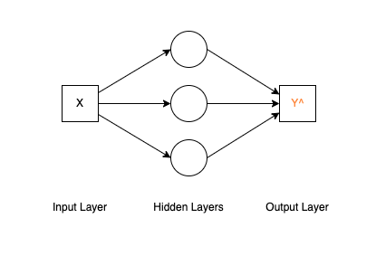

# Building Neural Networks from Scratch

`./neural_network.ipynb` is a simple implementation of a neural network from scratch. It uses the MSE loss function and the ReLU activation function..

## 1. Why do we need Neural Network?

There are some data points scattered on a 2D plane. A regression line is passing through them, illustrating the trend and relationship between the X and Y variables. We want to find the line.

In this case, Neural Networks can perform regression tasks by learning a mapping from input features (e.g., X) to target outputs (e.g., Y) through multiple layers of neurons. And the relationship between X and Y is non-linear, neural networks can capture these complexities using activation functions and multiple hidden layers.

## 2. What is the goal of Neural Network?

The goal of neural network is to approximate the target output (blue line) by adjusting its model output (orange line) to minimize the error between them.

## 3. How to archive it?

The image illustrates how a neural network approximates a target output (blue line) by combining multiple non-linear components (line1, line2, line3), each with specific slopes, to construct the model output.

Components: \
Line1: Starts at the origin with slope 1. \
Line2: Connects to Line1 with slope -2. \
Line3: Extends from Line2 with slope 2.

This represents how neural networks can approximate functions by combining multiple pieces (e.g., through activation functions and weighted sums).

## 4. What is Activation Function

An activation function introduces non-linearity to a neural network, allowing it to learn complex patterns and relationships in data.

`ReLU` outputs the input if it's positive, otherwise returns zero, mathematically defined as $f(x) = max(0, x)$. It is efficient and widely used in deep learning.

This showcases how ReLU can be modified to create more complex activation behaviors in neural network layers.

Left: The basic ReLU function $R(x)$.

Middle: The function is scaled as $R(2x)$, stretching the slope of the positive region by a factor of 2, effectively doubling the X-Y relationship for positive values.

Right: The function transforms into $-R(2x - 2)$, where it is shifted to the right by 1 unit and flipped vertically, resulting in a downward slope for positive values.

## 5. The Neural Network is formed

- Line 1, Line 2, Line 3 represent different components of the model output.
- The overall model output $\hat{Y}$ is the combination of these components:

    $
    \hat{Y} = R(R(X) - R(2X - 2) + R(2X - 4))
    $

This diagram illustrates a neural network with ReLU activations that computes the final predicted output $\hat{Y}$ through multiple layers of linear and non-linear transformations. 

## 6. Loss Function

A loss function is a mathematical function that measures the difference between a model's predicted output ($\hat{Y}$) and the true target output ($Y$). \
e.g. Mean Squared Error (MSE) (for regression tasks)

$
MSE = \frac{1}{n} \sum_{i=1}^{n} (\hat{Y_i} - Y_i)^2
$

## 7. Gradient Descent

It is an optimization algorithm used in machine learning to minimize a loss function by iteratively adjusting the model's parameters (e.g., weights and biases). It helps the model learn by finding the parameters that result in the smallest possible loss.